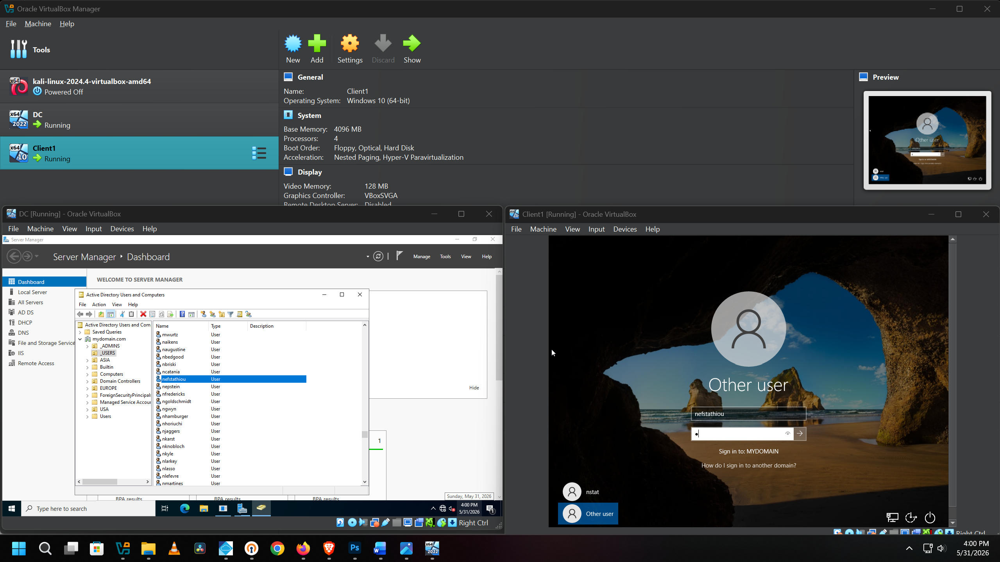
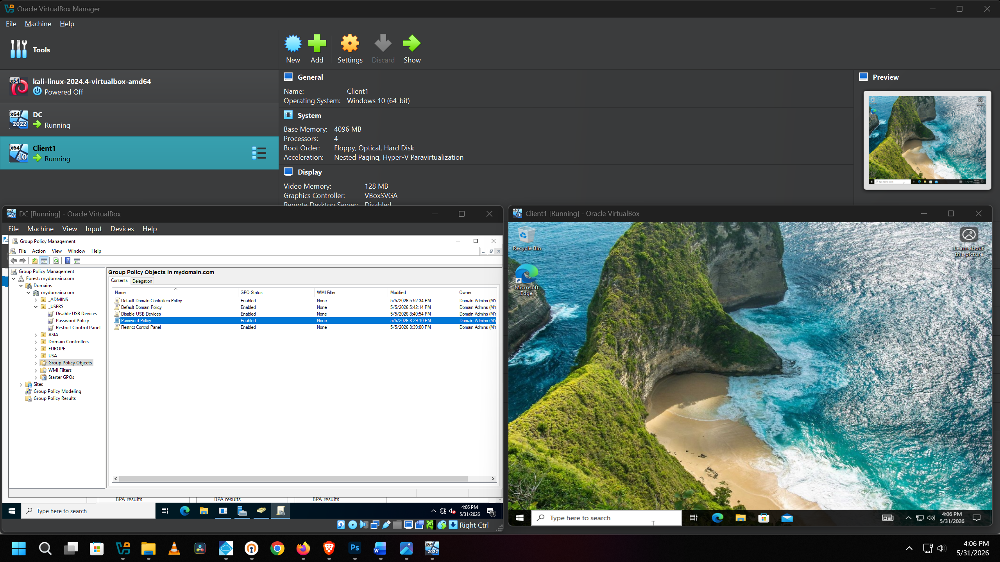
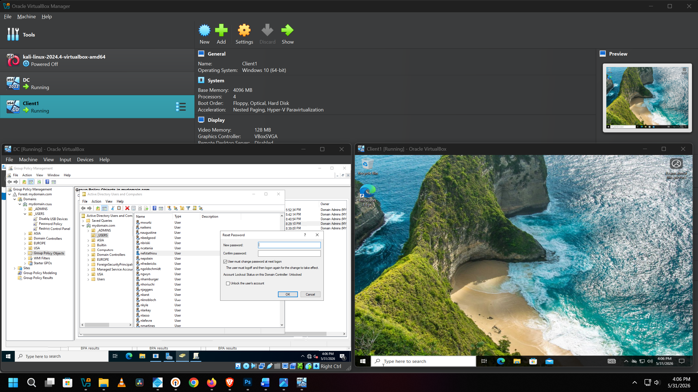

# 🔒 Active Directory Home Lab Environment

A fully virtualized Active Directory Domain Services (AD DS) environment built on Windows Server 2022 and joined to a Windows 10 Pro client machine. This project simulates a real-world enterprise network to practice corporate identity management, security hardening, and system administration workflows.

---

## 🧰 Technologies & Tools

| Category | Technology |
|---|---|
| Network Operating System | Windows Server 2022 Standard |
| Client Operating System | Windows 10 Pro |
| Hypervisor | Oracle VM VirtualBox |
| Core Directory Service | Active Directory Domain Services (AD DS) |
| Automation / Scripting | PowerShell |
| Policy Management | Group Policy Objects (GPOs) |
| Management Tools | Active Directory Users & Computers (ADUC) / Group Policy Management Console (GPMC) |

---

## 💻 Environment Architecture & Automation

The core of the lab runs on a virtualized Windows Server 2022 instance acting as the primary Domain Controller (DC). To simulate an enterprise environment efficiently, user provisioning was completely automated using a custom PowerShell script. This script processed bulk user account creation while applying consistent corporate naming conventions across the entire domain. 

A dedicated Windows 10 Pro virtual machine serves as the client workstation, properly configured and joined to the local domain to test user access, policies, and network connectivity.

---

## 🖥️ Active Directory Domain User Login

VirtualBox environment showing the Windows Server 2022 domain controller running alongside the domain-joined Windows 10 Pro client machine. A newly created Active Directory user account is logging into the domain, confirming successful AD DS setup, automated user provisioning, and proper domain join configuration.

---

## 🛡️ Group Policy Objects & Security Hardening

The Group Policy Management Console (GPMC) was utilized on the Windows Server 2022 domain controller to enforce baseline security controls across all domain-joined endpoints. Instead of leaving default configurations, specific Group Policy Objects (GPOs) were built and linked to enforce corporate security compliance.

**Implemented Security Policies:**

* **Password Complexity Requirements:** Enforced minimum password lengths, history restrictions, and complexity rules to mitigate credential-stuffing attacks.
* **Control Panel Restrictions:** Blocked standard user access to administrative system settings to prevent unauthorized configuration changes.
* **USB / Removable Media Blocking:** Disabled read/write access for external storage drives to protect against data exfiltration and malware introduction.

---

## 👥 Sysadmin Workflows & Helpdesk Operations

Beyond initial deployment, the environment serves as a sandbox for executing routine IT operations and administrative tasks through Active Directory Users and Computers (ADUC). 

**Simulated Enterprise Workflows:**
* **Organizational Unit (OU) Structuring:** Created a logical OU hierarchy reflecting real-world corporate departments (e.g., IT, HR, Finance) for targeted GPO application.
* **Identity Management:** Managed the full user lifecycle, including creating accounts, disabling stale objects, and modifying security group memberships.
* **Helpdesk Support Simulation:** Practiced responding to common administrative tickets including manual password resets and unlocking accounts triggered by brute-force lockouts.

---
## 📌 Credits

Lab inspired by and built following [Josh Madakor's](https://www.youtube.com/@JoshMadakor) Active Directory home lab tutorial.

---

## 🙋 Author

**Nick Efstathiou**
Cybersecurity | System Administration | Home Lab  
[LinkedIn](https://www.linkedin.com/in/NickStat23)
